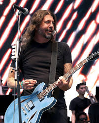
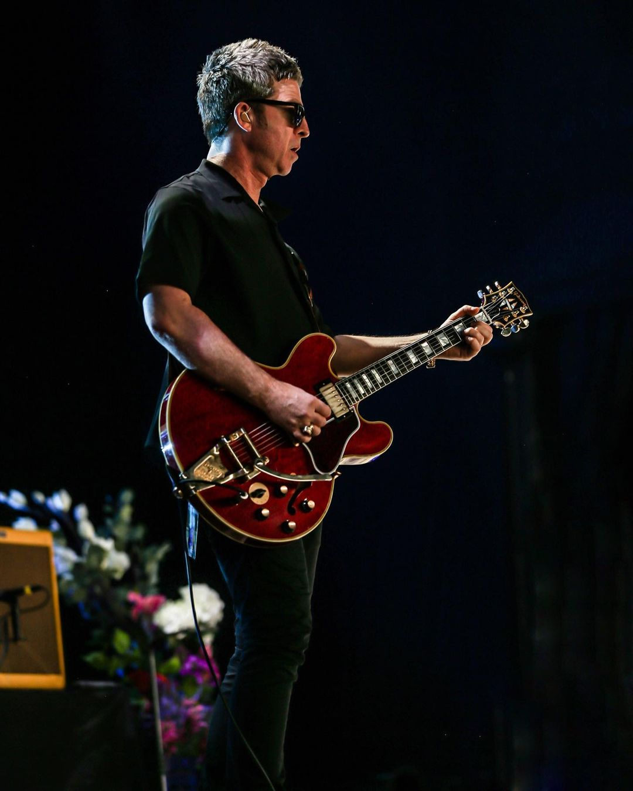
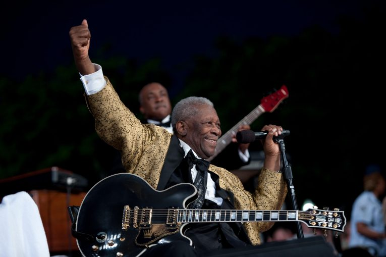

It's quite funny, when I saw an ES-335 maybe a decade ago now, I thought it was the ugliest guitar I had ever laid my eyes on. I am not exactly sure whether it was from a live performance of Oasis with Noel Gallagher's cherry red 335 or Foo Fighters' Dave Grohl's blue Epiphone, but I just remember thinking, *"God, what a hideous guitar. Why is it so big? Why is it so round? Why does it have holes on it? We already have acoustic guitars for that. Are they stupid?"*

It's 2025 now, and I am in awe of the elegance it exudes. I once called it the "Holy Grail" of Electric Guitars and I still stand by it. I was gifted a beautiful Cherry Red Gibson ES-335 by an uncle of mine a few months ago (Thanks, Kullu kaka!), and to say the least, I worship it like a deity.

  
  

### What Changed

My taste and interest in music are very much shaped by my initial exposure to it. My dad introduced me to the artists he used to listen to back when he was a teenager, and this was all 80s pop and rock. There was a time in my life where I think I only listened to *"I Want to Break Free"* and *"Bohemian Rhapsody"* by Queen for a whole month straight. Then came my cousin, who listened to more grunge, metal, and psychedelic rock. This was the likes of Nirvana, Metallica, and Pink Floyd. I think these bands were a huge reason as to why I later on quite obsessively learned the guitar.

#### Arrival of the King

At 19, I was obsessed with this instrument and everything that revolved around it, whether it be the makers, the artists, the pedals, or the amps. This was about the time I had *just* started to mellow down towards the 335, seeing all the jazz musicians used it, and I had a lot of respect for them because I couldn't even fathom how much effort and intelligence you would need to get that good on this instrument. But still, I thought the Stratocasters and Les Pauls were much cooler. After all, all the rockstars used them.

I used to spend hours and hours trying to nail those fast and loud riffs and solos. I would manically listen to and watch my favorite guitar players play live or talk about playing in interviews. A strange thing I realized was that all of them had, at one point, paid homage to this "B.B. King" fella. I decided to go check him out, playing a live recording of him in an interview. He was playing a black ES-335 and talked about bending a note while making guitar faces for like 15 minutes. Definitely not very exhilarating for someone like me.

Then I listened to *"The Thrill Is Gone"*, and it was an alright song but nothing to write home about, I thought. I called it a day. Even though I had delivered my critique in such haste, every day I would find myself listening to that song and watching that man play four notes in a billion different ways. It was magical. I guess I was finally feeling the blues.

With my newfound obsession also came a new intrigue for the guitar. I decided to do some research on the guitar and who else played it. I decided to read up on everything from how it was created to what pickup it uses to what wood it requires. To my surprise, I also found out Johnny Marr from The Smiths and Larry Carlton from Steely Dan were both huge ES-335 aficionados. But despite the 335 having numerous giants playing it, B.B. King would always be the face of it. Who could complain, though, the man literally wrote a whole song about that guitar. (Check out *"Lucille"* if you haven't.)

  

In the span of a couple of years, I have gone from idolizing those rockstars who were always shirtless with six-packs, always running around at 10 kilometers an hour while playing music fast and loud with sleek, edgy, dark guitars (still love all of them :D), to becoming a huge admirer of a rather large man who always played in his gentleman suit, took his God-given time to dish out a note while sitting on a chair on stage with an ES-335. I guess I'm growing up.
